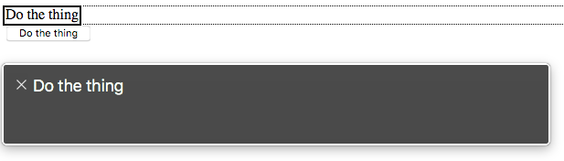
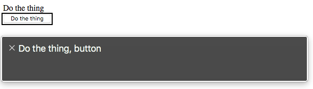

I've been thinking about the complexity required for making accessible buttons, or rather interactive elements. One pattern that has bothered me a lot recently is what I call the 'non-button button'. This is an interactive element that is used like (and sometimes even looks like) a `button` but for whatever reason it is not an HTML `button` element. This poses a huge problem for accessibility and I want to dive into _why_ that is. 

Let's begin with an example of a non-button button:

```html
<div class="myBtn">Do the thing</div>

<script>
const handleClick = (e) => {
  console.log('myBtn clicked')
}
const myBtn = document.querySelector('.myBtn')
myBtn.addEventListener('click', handleClick)
</script>
```
<small>Don't get hung up on how the event be being bound; the principles would be the same if you were using jQuery, React, etc.</small>

The main reason I've found for using this pattern is for when the clickable element absolutely requires block level elements. The HTML `button` is an inline element and cannot contain block level elements. And even then, I've worked around this requirement by using [Event Delegation](https://davidwalsh.name/event-delegate). But for comparison and teaching, I'll go over what it would take to reach feature parity with a button.

### Keyboard pt 1: Focus

One problem with this non-button is that it cannot receive focus, and therefore cannot be navigated to with a keyboard. This means that there is no way to trigger it without using a mouse and clicking on the element. The HTML `button` however does allow focus so we'll need to achieve the same. This can be done with the `tabindex` attribute. Setting this attribute to `0` simply adds the element to the tab order.  

```html
<div class="myBtn" tabindex="0">Do the thing</div>
```

Now you can tab to this element with your keyboard, and see the keyboard outline when focused on it. HTML buttons are focusable by default. 

### Keyboard pt 2: Events

Focusing on an element is only half of the keyboard navigation story. The element should also respond to keyboard `Enter` or `Space` events to trigger the same `'click'` action. This is a feature that HTML `buttons` can give you for free.

```html
<div class="myBtn" tabindex="0">Do the thing</div>

<script>
const handleClick = (e) => {
  console.log('myBtn clicked')
}
const handleKeyboardClick = (fn) => {
  return (e) => {
    if(e.key === 'Enter' || e.key === ' ') {
      return fn(e)
    }
  }
}
const myBtn = document.querySelector('.myBtn')
myBtn.addEventListener('click', handleClick)
myBtn.addEventListener('keydown', handleKeyboardClick(handleClick))
</script>
```

Take a look at the `handleKeyboardClick` function above. This is a small [curried function](https://www.sitepoint.com/currying-in-functional-javascript/) that accepts a function as a parameter (`fn`), and returns a function that will guard executing `fn` only if the event key is `'Enter'` or `' '` (Space). This helper can be reused to wrap any additional click handlers that we may need also need to bind later.

I'd like to note that this additional event binding isn't necessary if using an HTML button. It will trigger click handlers when Enter or Space is pressed. 

### Semantics

Now that we can reach the element with a keyboard, let's switch to using another assistive device: a screenreader. A screenreader allows a non-visual user to be able to navigate and read the page content. So what happens when such a user navigates to our non-button? 



Let's compare this with an actual button, which I've added underneath the non-button button. 



It shouldn't be any surprise to see that a div semantically doesn't represent anything. It should also be noted that the CSS class name that we're using to select this element offers nothing for assistive tech to identify. Also not surprising is that the HTML button is identfied as a button. 

We can fix this by adding the correct aria-role attribute. If you haven't yet read through the <a class="link" href="https://www.w3.org/TR/wai-aria-practices-1.1/">WAI-ARIA Authoring Practices</a> it is time you did. It outlines the following:

- If this control is a *push button*, it needs a `role="button"` to designate it as an interactive button
- if this control is a *toggle button*, it needs `role="button"` and `aria-pressed` attributes, and `aria-pressed` is updated to reflect the current state of the control (eg. `aria-pressed="true"`)

```html
<div class="myBtn" tabindex="0" role="button">Do the thing</div>
<!--- OR --->
<div class="myBtn" tabindex="0" role="button" aria-pressed="false">Do the thing</div>

<script>
const handleClick = (e) => {
  console.log('myBtn clicked')
  // If you need to update the aria-pressed
  
  const pressed = e.target.getAttribute('aria-pressed') === 'true'
  e.target.setAttribute('aria-pressed', pressed);
}
const handleKeyboardClick = (fn) => {
  return (e) => {
    if(e.key === 'Enter' || e.key === ' ') {
      return fn(e)
    }
  }
}
const myBtn = document.querySelector('.myBtn')
myBtn.addEventListener('click', handleClick)
myBtn.addEventListener('keydown', handleKeyboardClick(handleClick))
</script>
```